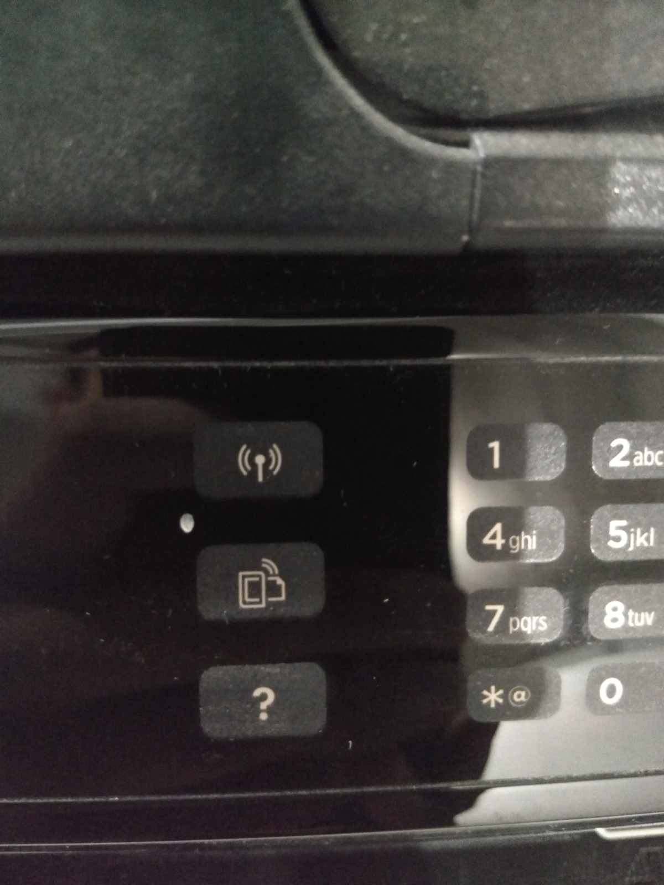
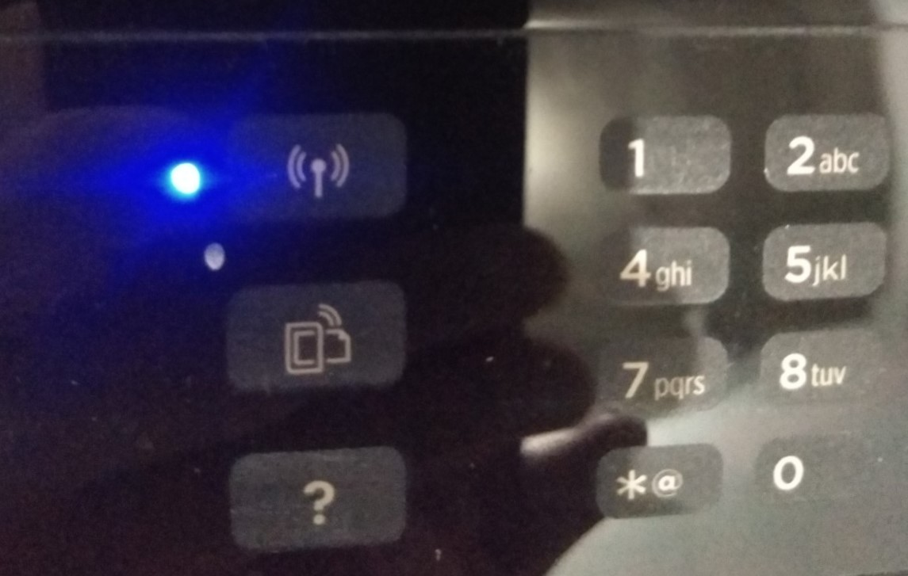
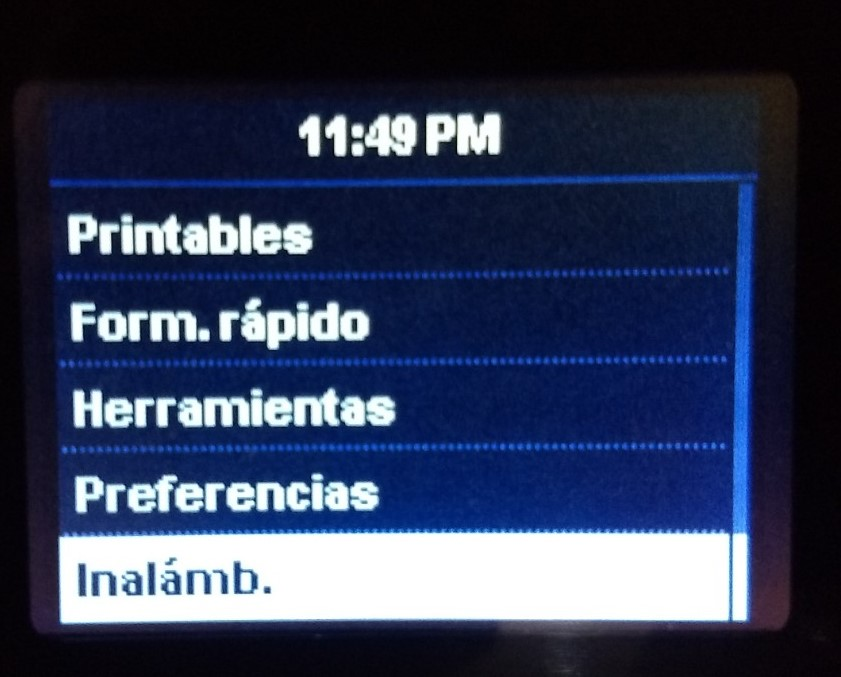
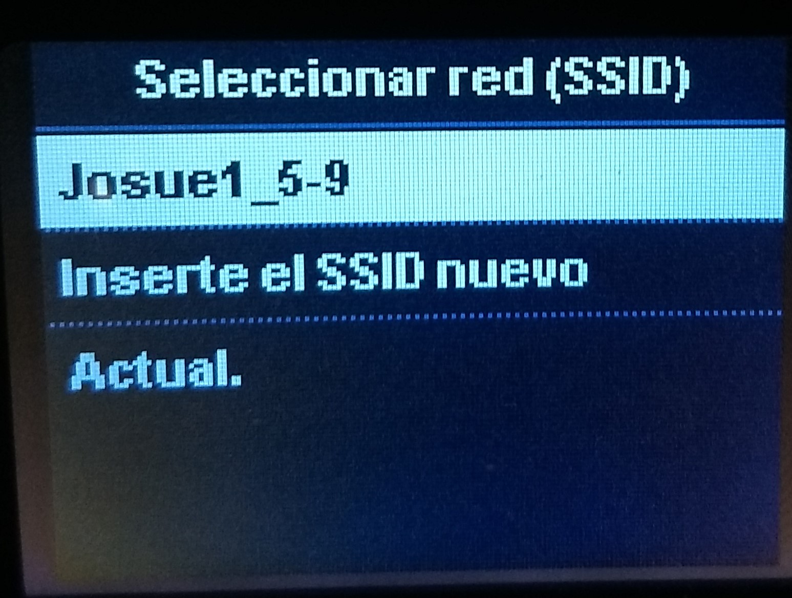

# COMPRTIR IMPRESORA VÍA WI-FI

Trabajando con el modelo **Deskjet** Ink Advantage 4645 de una impresora *hp*, deben seguirse los siguientes pasos para que esta funcione en un entorno de trabajo que usa red Wi-fi compartida.

    1. Una vez encendida la impresora, se activa el modo Wi-fi. Se presiona entonces el botón con el ícono del mismo, este se ubica en la parte superior intermedia, entre la pantalalla y los botones numericos. Se puede ayudar con la siguiente imagen.   
   
    

    2. Al haber presionado el botón, se mostrará en la pantalla un mensaje, debes presionar el botón **ok** que activará el modo Wi-fi. Este paso sabrás que es correcto cuando veas una luz azul, a un lado del botón del ícono de Wi-fi. 
   
    

    3. Presiona ahora el boton de menú principal, ícono de home, y buscar la última opción *"inaláb."*, seleccionarla con **ok**.
    

    4. Entra ahora a la opción de *"Asist. Inst. inalámbrica"* y esperar a que encuentre las redes Wi-fi disponibles.
    

    5. Una vez completada la búsqueda, seleccionar la red deseada e introducir la contraseña con los botones alfanumériocos.
     
